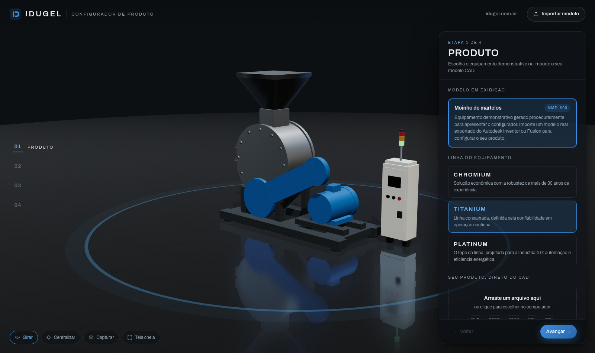
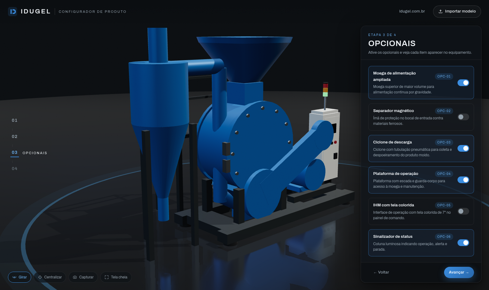

# Configurador de Produto — Idugel

Configurador 3D de equipamentos industriais no estilo do [configurador da Cirrus Aircraft](https://configurator.cirrusaircraft.com/configurator/visionjet), feito para ser incorporado ao site da [Idugel](https://www.idugel.com.br).



**Demo pública:** <https://zalayata.github.io/configurador-de-produto/>

## O que ele faz

- **Visualizador 3D cinematográfico** — palco escuro com piso refletivo, iluminação de estúdio industrial e câmera que voa para o ângulo certo a cada etapa.
- **Produto demonstrativo** — um moinho de martelos (carro-chefe da Idugel) gerado proceduralmente, com as linhas Chromium / Titanium / Platinum.
- **Configuração por etapas** — Produto → Acabamento → Opcionais → Resumo, como no configurador da Cirrus.
- **Acabamentos reais** — inox 304 escovado, inox polido e pinturas RAL, aplicados por conjunto (corpo, estrutura, motor, painel).
- **Opcionais visíveis em 3D** — moega ampliada, separador magnético, ciclone de descarga, plataforma de operação, IHM colorida e sinalizador acendem/aparecem na cena.
- **Importação de modelos CAD** — arraste um arquivo **STEP, IGES, GLB, STL ou OBJ** para dentro da tela. A conversão acontece no navegador (OpenCascade em WebAssembly) — nada é enviado a servidores.
- **Personalização por peça** — no modelo importado, cada peça pode receber cor própria ou ser ocultada.
- **Resumo e compartilhamento** — link compartilhável da configuração, resumo em texto, captura PNG, ficha em PDF (impressão) e exportação de GLB otimizado.



## Como importar do Autodesk Inventor ou Fusion

O caminho recomendado é o **STEP**, formato universal que os dois programas exportam nativamente:

| Origem | Caminho |
|---|---|
| **Inventor** | Arquivo → Exportar → Formato CAD → `STEP (*.stp)` — exporte a montagem (`.iam`) inteira para ter cada componente como peça configurável |
| **Fusion** | Arquivo → Exportar → `STEP (*.step)` — ou botão direito no componente na árvore → Exportar |

Depois é só arrastar o arquivo para o configurador. Para modelos grandes, importe o STEP uma vez e use **"Exportar GLB otimizado"** na etapa Resumo — o GLB gerado carrega em uma fração do tempo e é o formato ideal para publicar um produto fixo no site.

### Por que não importar `.ipt`/`.iam`/`.f3d` direto?

Os formatos nativos do Inventor/Fusion são proprietários. Para lê-los seria preciso a **Autodesk Platform Services** (APS/Forge, API Model Derivative): conta Autodesk, tokens de API, envio do arquivo para a nuvem da Autodesk e custo por conversão. A rota STEP-no-navegador escolhida aqui é gratuita, offline e sem dependência de terceiros. Se um dia fizer sentido ler os nativos, a APS pode ser plugada como caminho alternativo sem jogar nada fora.

## Rodando localmente

```bash
npm install
npm run dev      # desenvolvimento em http://localhost:5173
npm run build    # gera a versão de produção em dist/
npm run preview  # serve o build localmente
```

Stack: Vite + React + TypeScript, Three.js via react-three-fiber/drei, Zustand, e [occt-import-js](https://github.com/kovacsv/occt-import-js) (OpenCascade compilado para WebAssembly, LGPL-2.1) para STEP/IGES/BREP.

## Deploy

O workflow `.github/workflows/deploy.yml` publica automaticamente no **GitHub Pages** a cada push na `main`. O build usa caminhos relativos (`base: './'`), então o mesmo `dist/` funciona no Pages, em domínio próprio ou dentro de iframe.

## Incorporando ao site da Idugel

O configurador foi feito para viver dentro de qualquer página via iframe:

```html
<iframe
  src="https://zalayata.github.io/configurador-de-produto/"
  style="width: 100%; height: 90vh; border: 0; border-radius: 12px"
  allowfullscreen
  title="Configurador de produto Idugel"
></iframe>
```

Quando quiser servir em domínio próprio (ex.: `configurador.idugel.com.br`), basta apontar um CNAME para o GitHub Pages ou copiar a pasta `dist/` para qualquer hospedagem estática — não há backend.

## Personalização

| O quê | Onde |
|---|---|
| Links, e-mail comercial e WhatsApp | `src/config/branding.ts` |
| Cor de destaque e tema | variáveis CSS em `src/styles/global.css` (`--accent`) |
| Acabamentos, grupos, opcionais e linhas | `src/config/product.ts` |
| Produto demonstrativo 3D | `src/three/DemoModel.tsx` |

## Próximos passos sugeridos

- Catálogo de produtos reais: exportar cada equipamento do Inventor como STEP, converter em GLB pelo próprio app e commitar em `public/models/`.
- Conversão de STEP em Web Worker para não pausar a interface em arquivos muito grandes.
- Formulário de orçamento integrado (hoje o botão leva ao site da Idugel).
- Preços/códigos por opcional, se a área comercial quiser expor.
