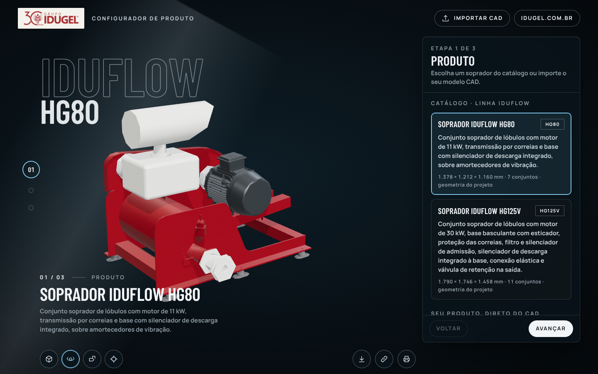
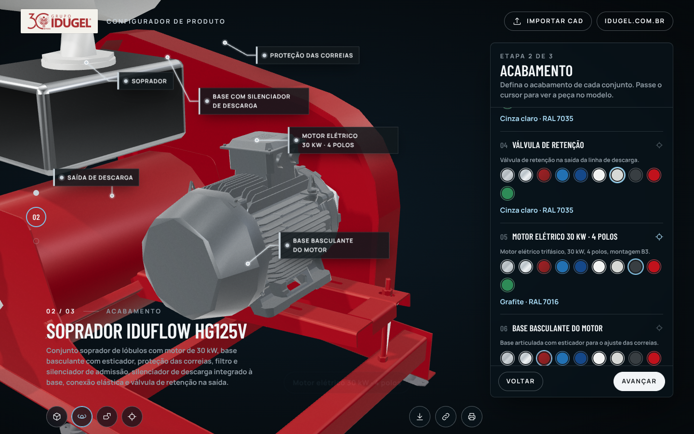

# Configurador de Produto — Idugel

Configurador 3D de equipamentos industriais do [Grupo Idugel](https://www.idugel.com.br), na linha visual
do hotsite da linha Chromium: palco escuro em tela cheia, interface cromo com acento azul-aço, títulos
condensados em caixa alta, controles circulares e o mesmo visualizador 3D (corte com tampa sólida, vista
explodida, etiquetas, câmera em arco, PNG com legenda).



**Demo pública:** <https://zalayata.github.io/configurador-de-produto/>

## O que ele faz

- **Catálogo IduFlow** — sopradores **HG80** (11 kW, 2 polos) e **HG125V** (30 kW, 4 polos), com geometria
  do projeto convertida para GLB e um grupo por conjunto (soprador, admissão, descarga, motor, base
  basculante, polias, proteção, base com silenciador integrado, amortecedores).
- **Três etapas** — Produto → Acabamento → Resumo. A câmera voa em arco para o enquadramento de cada etapa.
- **Acabamento por conjunto** — inox e pinturas RAL aplicados com transição; passar o cursor pelo painel
  realça a peça no modelo, clicar leva a câmera até ela.
- **Explorar** — vistas, corte X/Y/Z com tampa sólida e hachura, vista explodida, etiquetas, giro.
- **Importação CAD** — arraste um **STEP, IGES, GLB, STL ou OBJ**; a conversão acontece no navegador
  (OpenCascade em WebAssembly) e cada peça vira um grupo com cor e visibilidade próprias.
- **Saídas** — link da configuração na URL, resumo em texto, PNG com logo e legenda, ficha A4 para impressão.



## Rodando localmente

```bash
npm install
npm run dev      # http://127.0.0.1:5173
npm test         # consistência do catálogo e dos GLBs
npm run build    # produção em dist/
```

Stack: Vite + JavaScript ES modules + Three.js. Sem framework. Fontes locais (Barlow Condensed e Manrope,
OFL) em `public/fonts/`.

## Catálogo e modelos 3D

Cada produto nasce de um STEP do projeto, convertido fora do navegador por `tools/cad/converter-step.mjs`
para um GLB compacto com `userData` por malha e um manifesto com proveniência. Passo a passo, grupos e
bancada de conferência: [`docs/MODELOS-3D.md`](docs/MODELOS-3D.md). Contrato e extensões do visualizador:
[`docs/VISUALIZADOR.md`](docs/VISUALIZADOR.md). Plano de alinhamento à linha Chromium:
[`docs/LINHA-CHROMIUM.md`](docs/LINHA-CHROMIUM.md).

```bash
# converter um STEP novo
node tools/cad/converter-step.mjs --produto tools/cad/produtos/iduflow-hg80.json --step "<arquivo.STEP>"
# bancada (com npm run dev ligado)
# http://127.0.0.1:5173/harness/index.html?modelo=iduflow-hg80&vista=iso
# captura
node tools/shot.mjs --url "http://127.0.0.1:5173/?movimento=reduzido" --out capturas/produto.png
```

## Personalização

| O quê | Onde |
| --- | --- |
| Dados institucionais, links e logotipo | `src/config/marca.js`, `public/media/idugel-30-anos.png` |
| Acabamentos (inox, RAL) | `src/config/acabamentos.js` |
| Produtos do catálogo (nome, código, especificações, acabamento padrão por grupo) | `src/catalog/products.js` |
| Grupos e rótulos do modelo 3D de cada produto | `tools/cad/produtos/<id>.json` → `src/catalog/modelos/<id>.json` |
| Tokens visuais (cores, tipografia, espaços) | `:root` em `src/style.css` |

## Deploy e incorporação

O workflow `.github/workflows/deploy.yml` publica no GitHub Pages a cada push. O build usa caminhos
relativos (`base: './'`): o mesmo `dist/` funciona no Pages, em domínio próprio ou dentro de iframe.

```html
<iframe
  src="https://zalayata.github.io/configurador-de-produto/"
  style="width: 100%; height: 90vh; border: 0; border-radius: 12px"
  allowfullscreen
  title="Configurador de produto Idugel"
></iframe>
```

## Próximos passos

- Banco de cilindros Linha Chromium no catálogo quando o STEP chegar.
- Especificações comerciais e opcionais por soprador (vazão, pressão, acessórios) a partir dos dados da área comercial.
- Correias procedurais entre as polias (os STEP trazem só as polias).
- Leitura linear com todo o conteúdo, como no hotsite.
