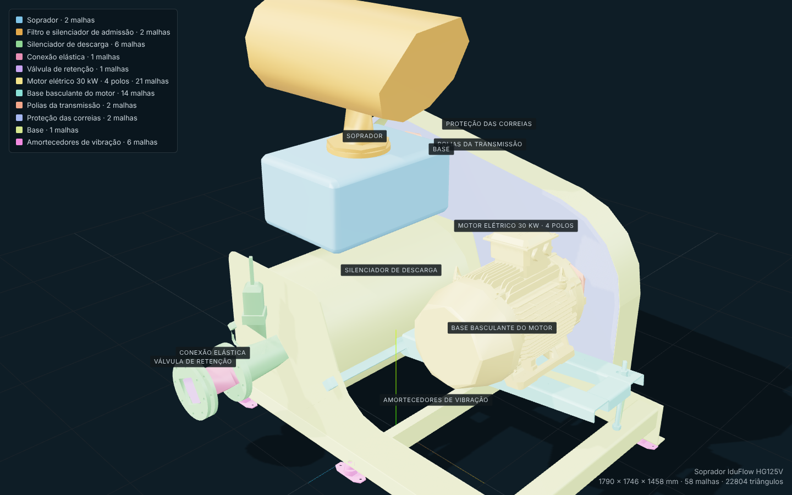

# Modelos 3D do catálogo — do CAD ao configurador

Segue o método do hotsite da linha Chromium (`MODELO-3D.md` daquele pacote): a geometria pública é
gerada a partir do projeto, fora do navegador, com um conversor determinístico; cada malha leva o
grupo a que pertence; os nomes públicos vêm de um manifesto e nunca do CAD; e a proveniência
(hash do arquivo de origem e do GLB) fica registrada.

## 1. Produtos convertidos

| Produto | Origem | Malhas | Triângulos | GLB | Dimensões (C × A × P) |
| --- | --- | --- | --- | --- | --- |
| Soprador IduFlow HG80 | montagem `HG80 2P-11KW` (SolidWorks 2024, STEP AP203) | 24 | 15.759 | 580 KB | 1.378 × 1.212 × 1.160 mm |
| Soprador IduFlow HG125V | montagem `HG-125 4p-30kw` (SolidWorks 2024, STEP AP203) | 58 | 22.804 | 834 KB | 1.790 × 1.746 × 1.458 mm |

Os STEP de origem não entram no repositório. O hash SHA-256 de cada um está no manifesto do produto
(`src/catalog/modelos/<id>.json`, campo `origem.sha256`), junto com o hash do GLB gerado.

## 2. Arquivos

| Arquivo | Conteúdo |
| --- | --- |
| `tools/cad/converter-step.mjs` | Conversor STEP → GLB (Node + occt-import-js) |
| `tools/cad/produtos/<id>.json` | Manifesto de entrada: grupos, rótulos públicos, regras de seleção das malhas |
| `public/models/<id>.glb` | Geometria pública, em metros, Y para cima, piso em y = 0, centro em x = z = 0 |
| `src/catalog/modelos/<id>.json` | Manifesto de saída: grupos com limites e âncoras, contagens, proveniência |
| `src/catalog/products.ts` | Dados comerciais do produto (nome, código, especificações, acabamento padrão por grupo) |
| `src/catalog/loadCatalogModel.ts` | Carregamento do GLB no configurador (uma vez por produto) |
| `harness/index.html` + `harness/bancada.js` | Bancada neutra: cor por grupo, etiquetas nas âncoras, vistas |
| `tools/shot.mjs` | Captura de tela com o Chromium do Playwright |

## 3. Conversão

```bash
node tools/cad/converter-step.mjs --produto tools/cad/produtos/iduflow-hg80.json --step "<HG80 2P-11KW.STEP>"
node tools/cad/converter-step.mjs --produto tools/cad/produtos/iduflow-hg125v.json --step "<HG-125 4p-30kw.STEP>"
```

O que o conversor faz:

1. **Leitura.** OpenCascade em WebAssembly (`occt-import-js`, a mesma biblioteca da importação no
   navegador), com deflexão linear de 0,8 mm e angular de 0,35 rad.
2. **Agrupamento.** Cada malha é atribuída a um grupo pela primeira regra do manifesto que casar com o
   caminho de nós do CAD (expressão regular) ou com o índice da malha (`--listar` imprime a lista).
   Malha sem grupo ou grupo vazio interrompem a gravação.
3. **Normalização.** Milímetros → metros; piso (ponto mais baixo, os amortecedores) em y = 0; centro
   da caixa envolvente em x = z = 0. Rotação opcional em Y para a frente do produto olhar para +Z.
4. **Solda.** Vértices com a mesma posição (0,01 mm) e a mesma normal viram um só. As normais vêm do
   OpenCascade; quando faltam, são calculadas.
5. **GLB.** glTF 2.0 binário escrito sem dependências: um nó por grupo, um nó filho por malha, com
   `extras = { groupId, label, peca, origem }`; um material por grupo (cor neutra do manifesto; o
   configurador troca pelo acabamento). Posições em float32 com `min`/`max`, índices de 16 bits quando
   cabem.
6. **Manifesto de saída.** Limites e âncora de etiqueta por grupo, contagens, bytes, hash do STEP e do
   GLB, data.

## 4. Grupos

Nomes de peça do CAD estão em chinês e citam o fabricante do motor; nenhum deles é publicado. Os
rótulos abaixo são os do manifesto.

**HG80** — `soprador` (cabeçote com o silenciador de admissão, um só sólido no CAD) · `descarga`
(flange de saída do silenciador integrado) · `motor` (11 kW, 2 polos) · `base-motor` (trilhos e eixo de
basculamento) · `transmissao` (polias SPC 200 × 3) · `base` (base com silenciador de descarga integrado e
proteção das correias, um só sólido) · `amortecedores` (6).

**HG125V** — `soprador` (cabeçote e flange de apoio) · `admissao` (filtro e silenciador sobre o
soprador) · `descarga` (tubo de saída com flanges e válvula de alívio) · `conexao-elastica` ·
`valvula` (retenção) · `motor` (30 kW, 4 polos) · `base-motor` (trilhos, eixo de basculamento e
esticador M20) · `transmissao` (polias SPC 250 × 3 e SPC 200 × 3) · `protecao` (carenagem das
correias) · `base` (base com silenciador de descarga integrado e pedestal) · `amortecedores` (6).

Correias não constam nos STEP (só as polias). Podem ser acrescentadas por código, como no hotsite.

## 5. Conferência

Bancada com o servidor de desenvolvimento ligado (`npm run dev`):

```
http://127.0.0.1:5173/harness/index.html?modelo=iduflow-hg125v&vista=iso&cores=grupo&etiquetas=1
```

Parâmetros: `modelo`, `vista` (`iso | frente | lateral | tras | topo | motor`), `cores`
(`grupo | natural`), `etiquetas` (`1 | 0`), `fundo` (`escuro | claro`), `grupo` (id a isolar).
A página define `window.__READY` e `window.__modelInfo` (malhas, triângulos, malhas sem `userData`).

Captura:

```bash
node tools/shot.mjs --url "http://127.0.0.1:5173/harness/index.html?modelo=iduflow-hg80&vista=iso" --out capturas/hg80-iso.png
```



## 6. Acrescentar um produto

1. Exportar a montagem em STEP (Inventor, Fusion ou SolidWorks).
2. Listar as malhas: `node tools/cad/converter-step.mjs --produto <manifesto> --step <STEP> --listar`.
3. Escrever `tools/cad/produtos/<id>.json` com os grupos, rótulos públicos e regras de seleção.
4. Converter, conferir na bancada, ajustar o manifesto até cada grupo cair no lugar certo.
5. Registrar o produto em `src/catalog/products.ts` (nome, código, especificações, acabamento padrão
   por grupo) e importar o manifesto gerado.
